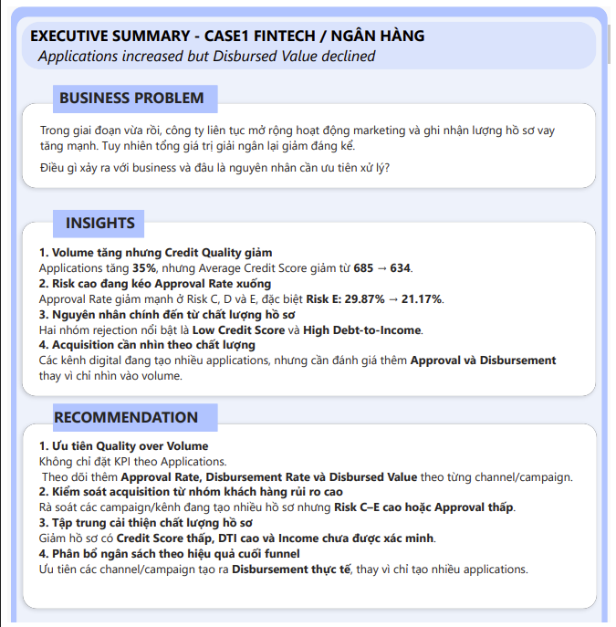
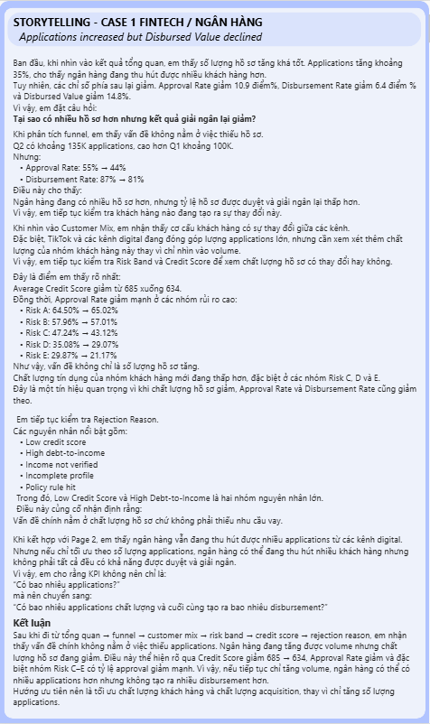
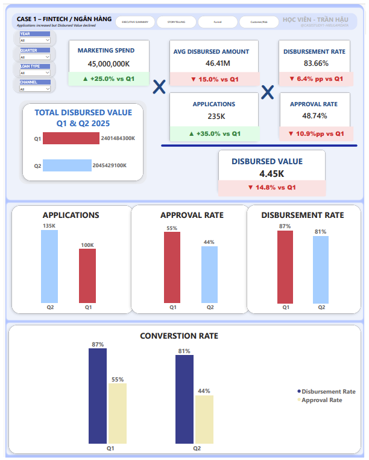
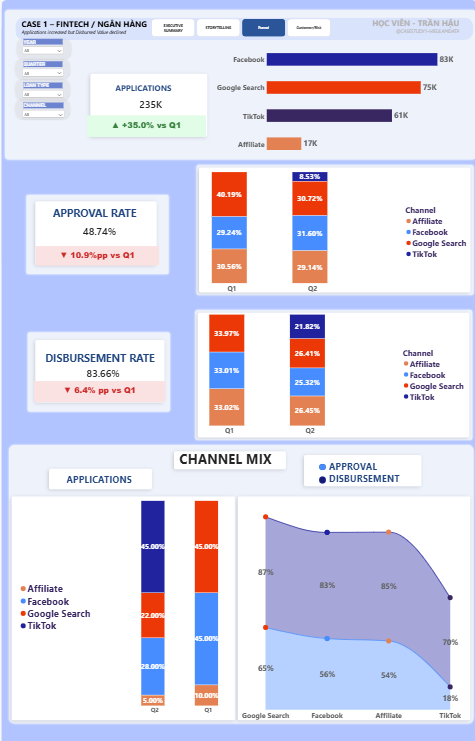
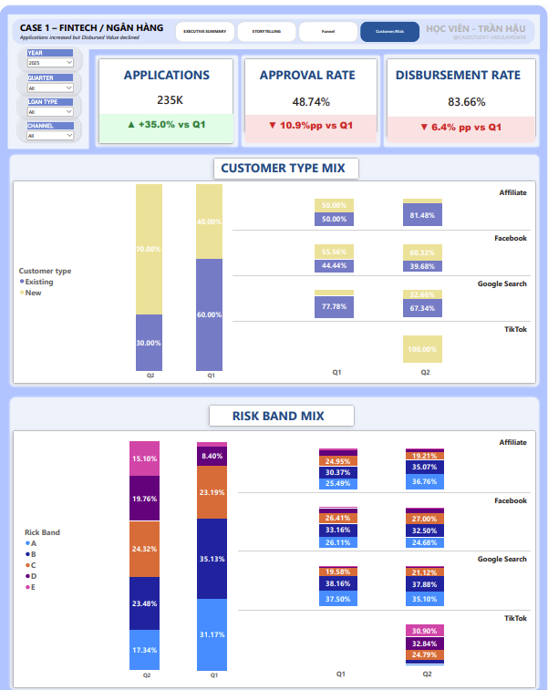
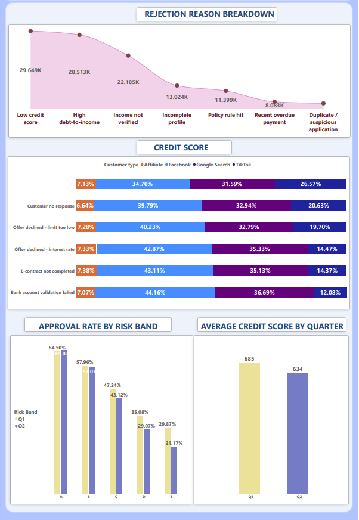

# Fintech Loan Performance Analysis — Power BI Dashboard

## Dashboard Overview

This Power BI dashboard analyzes the performance gap between loan applications and disbursed value.

The analysis investigates why loan applications increased while approval performance and disbursed value declined.

---

## Business Question

> Why did loan applications increase while total disbursed value decreased?

The analysis follows the business journey from overall performance to funnel conversion, customer mix, risk profile and rejection reasons.

---

## Dashboard Pages

### 1. Executive Summary

The Executive Summary provides an overview of the business performance and highlights the main performance gap.

---

### 2. Storytelling

The Storytelling page follows the analytical journey from:

**Applications → Funnel → Customer Mix → Risk Band → Credit Score → Rejection Reason**

---

### 3. KPI Analysis

The KPI page monitors the main performance indicators, including:

- Applications
- Approval Rate
- Disbursement Rate
- Average Disbursed Amount
- Marketing Spend
- Disbursed Value

---

### 4. Funnel Analysis

The Funnel page evaluates the conversion process from loan application to approval and disbursement.

---

### 5. Customer & Risk Analysis

This section provides a deeper analysis of customer characteristics, risk profiles, credit scores and rejection reasons.

#### Part 1 — Customer & Risk Overview

#### Part 2 — Credit & Rejection Analysis

---

## Key Findings

### 1. Application volume increased but credit quality declined

Applications increased by approximately **35%**, while average credit score declined from **685 to 634**.

### 2. High-risk customers contributed to the decline in approval performance

Approval Rate decreased particularly across Risk C, D and E.

Risk E declined from **29.87% to 21.17%**.

### 3. Application quality is a major issue

The main rejection reasons include:

- Low Credit Score
- High Debt-to-Income
- Income Not Verified
- Incomplete Profile
- Policy Rule Hit

### 4. Acquisition should be evaluated based on quality, not only volume

Digital channels generated a large number of applications, but performance should also be evaluated through approval and disbursement outcomes.

---

## Business Recommendations

### 1. Prioritize Quality over Volume

Do not evaluate acquisition performance only by the number of applications.

Monitor:

- Approval Rate
- Disbursement Rate
- Disbursed Value

by channel and campaign.

### 2. Control acquisition from high-risk customer segments

Review campaigns and channels generating high volumes of Risk C–E customers or low approval rates.

### 3. Improve application quality

Focus on reducing applications with:

- Low Credit Score
- High Debt-to-Income
- Unverified Income
- Incomplete Profiles

### 4. Allocate marketing budget based on downstream performance

Prioritize channels and campaigns that generate actual disbursement rather than only high application volume.

---

## Tools

- Power BI
- DAX
- Power Query
- SQL
- PostgreSQL

---

## Skills Demonstrated

- Business problem framing
- KPI analysis
- Funnel analysis
- Customer segmentation
- Risk analysis
- Data visualization
- Data storytelling
- Business insight generation
- Business recommendations
